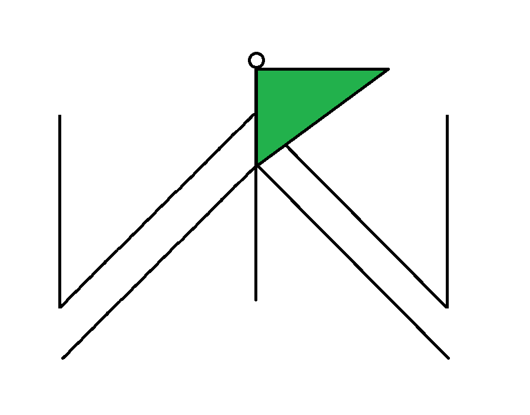

# WanderPath

برنامه‌ریز سفر داخلی ایران — فارسی و راست‌چین. شهر و جاذبه پیدا کنید، برنامهٔ روزانه بچینید، بودجه و نقشه را ببینید.

بدون رزرو، پرداخت، یا دستیار هوش مصنوعی.

<p align="right">
  
</p>

| | |
| --- | --- |
| فرانت‌اند | Next.js 14، React 18، TypeScript |
| بک‌اند | Python 3.12، FastAPI، SQLite (لوکال) |
| ورود | گوگل، یا **ورود آزمایشی** برای دموی لوکال |

---

## اجرای سریع (حدود ۵ دقیقه)

دو ترمینال لازم است. اول بک‌اند، بعد فرانت.

### پیش‌نیاز

- [Python 3.12](https://www.python.org/downloads/)
- [Node.js 18+](https://nodejs.org/) (همراه npm)
- Git

کلون (آدرس ریپوی خودتان را بگذارید):

```bash
git clone https://github.com/YOUR_USER/wanderpath.git
cd wanderpath
```

اگر همین پوشه را دارید، همان `cd` به ریشهٔ پروژه کافی است.

---

### ۱) بک‌اند — پورت `8000`

**ویندوز (PowerShell):**

```powershell
cd backend
python -m venv .venv
.\.venv\Scripts\Activate.ps1
pip install -r requirements.txt
Copy-Item .env.example .env
python scripts/seed_data.py
python -m uvicorn app.main:app --reload --port 8000
```

اگر اجرای اسکریپت بسته بود:

```powershell
Set-ExecutionPolicy -Scope Process -ExecutionPolicy Bypass
```

**macOS / Linux:**

```bash
cd backend
python3 -m venv .venv
source .venv/bin/activate
pip install -r requirements.txt
cp .env.example .env
python scripts/seed_data.py
python -m uvicorn app.main:app --reload --port 8000
```

آماده است وقتی ببینید سرور روی `http://127.0.0.1:8000` گوش می‌دهد.

- مستندات API: [http://localhost:8000/docs](http://localhost:8000/docs)
- دادهٔ نمونه (تهران، شیراز، اصفهان، مشهد، یزد و جاذبه‌ها) با `seed_data.py` می‌آید؛ برای دمو کلید Neshan لازم نیست.

---

### ۲) فرانت‌اند — پورت `3000`

ترمینال دوم، از ریشهٔ پروژه:

**ویندوز:**

```powershell
cd frontend
npm install
Copy-Item .env.example .env.local
npm run dev
```

**macOS / Linux:**

```bash
cd frontend
npm install
cp .env.example .env.local
npm run dev
```

مرورگر: **[http://localhost:3000](http://localhost:3000)**

---

### ۳) ورود و ساخت سفر

1. [http://localhost:3000/login](http://localhost:3000/login)
2. دکمهٔ **ورود آزمایشی** (بدون گوگل کار می‌کند؛ در `.env` بک‌اند `ALLOW_DEV_LOGIN=true` و `ENV=development` باشد)
3. بعد از ورود به `/app` می‌روید: نام سفر و بازهٔ تاریخ را بگذارید
4. در هاب، روی هر روز بزنید و مثلاً «شیراز» را جست‌وجو کنید

بدون این دو سرور همزمان، صفحه خالی یا خطای شبکه می‌دهد.

---

## تنظیمات اختیاری

فایل‌های واقعی `.env` را commit نکنید. نمونه در ریپو هست.

| فایل | حداقل لازم برای دمو |
| --- | --- |
| `backend/.env` | کپی از `.env.example` کافی است (`JWT_SECRET` و `ALLOW_DEV_LOGIN=true`) |
| `frontend/.env.local` | `NEXT_PUBLIC_API_BASE_URL=http://localhost:8000` |

**ورود با گوگل** (اختیاری): در [Google Cloud Console](https://console.cloud.google.com/) یک OAuth Client از نوع Web بسازید.

- JavaScript origin: `http://localhost:3000`
- Redirect: `http://localhost:3000/login/google/callback`
- همان Client ID را در `backend/.env` → `GOOGLE_CLIENT_ID` و `frontend/.env.local` → `NEXT_PUBLIC_GOOGLE_CLIENT_ID` بگذارید

اسکریپت کمکی: `scripts/setup-google-oauth.ps1`

**نقشه / مکان‌های بیشتر:** `NESHAN_API_KEY` در بک‌اند (کلید سرویس). تایل نقشه در مرورگر جداست: `NEXT_PUBLIC_NESHAN_API_KEY` (کلید وب). بدون آن‌ها هم با دادهٔ seed و تایل OpenFreeMap کار می‌کند.

---

## داخل برنامه چه می‌بینید

- صفحهٔ معرفی و برنامه‌های پیشنهادی (`/tours`)
- ساخت سفر چندروزه، برنامهٔ هر روز، اقامت و غذا
- بودجه به تومان، هوا، یادداشت، اشتراک خلاصهٔ فقط‌خواندنی
- رابط کاملاً فارسی (RTL)

جزئیات معماری: [`docs/architecture-spec.md`](docs/architecture-spec.md)

---

## ساختار پوشه

```
backend/     FastAPI
frontend/    Next.js
docs/        مشخصات معماری
scripts/     اسکریپت‌های کمکی لوکال
```

جزئیات بیشتر: [`backend/README.md`](backend/README.md) · [`frontend/README.md`](frontend/README.md)

---

## تست بک‌اند

```powershell
cd backend
.\.venv\Scripts\Activate.ps1
pytest
```

---

## English — run locally

You need **two terminals**. Python 3.12 and Node 18+.

**Backend** (`http://localhost:8000`):

```bash
cd backend
python -m venv .venv
# Windows: .\.venv\Scripts\Activate.ps1
# Unix:    source .venv/bin/activate
pip install -r requirements.txt
cp .env.example .env          # Windows: Copy-Item .env.example .env
python scripts/seed_data.py
python -m uvicorn app.main:app --reload --port 8000
```

**Frontend** (`http://localhost:3000`):

```bash
cd frontend
npm install
cp .env.example .env.local
npm run dev
```

Open `/login` and use **ورود آزمایشی** (dev login). Google OAuth and Neshan keys are optional for a local demo.

WanderPath is an Iran-only trip planner (RTL Persian UI). No bookings or payments.
